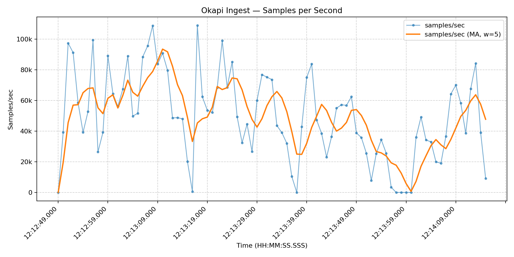

# Okapi - metrics aggregation with millisecond reads, cheap object storage and open formats

[](./LICENSE)
[](https://ghcr.io/okapi-core/okapi)
[](https://github.com/okapi-core/okapi/discussions)

Okapi is a metrics engine that leverages object storage and open formats such as Parquet to store metrics data.
The motivation here is to use disaggregated storage and compute for metrics to bring down the cost of storing historical
data while ensuring fast queries for recent data (where "recent" means couple of hours old).
Okapi does this by performing streaming rollups in an in-memory store and periodically exporting older data to S3 using
**Parquet** format so it can be analyzed
in **Snowflake**, **Databricks**, **DuckDB**, or just **Jupyter/Polars/Pandas setup**.

---

## Streaming rollups with an in-memory store

It is not practical to store recent metrics data directly to S3 since it can slow down reads and lead to sluggish
dashboards.
To counter this recent data is stored in an in-memory store on Okapi metric nodes.
Data is aggregated as it arrives which makes reads for recent data fast (see benchmarks below) and keeps write
throughput manageable (benchmarking indicates as *278k samples/s* throughput or around *16m samples/min*  on a single
node )

## Benchmark Report

Benchmarks were run on **bare-metal JVM (Java 22, NVMe disk)**.

| Metric                      | Value                                          |
|-----------------------------|------------------------------------------------|
| **Ingest throughput**       | **283,500 samples/s** (1,418 req/s, batch≈200) |
| **Ingest latency (ms)**     | p50 = 0.6 · p90 = 0.7 · p99 = 1.2              |
| **Read latency – SECONDLY** | p50 = 449 µs · p90 = 496 µs · p99 = 902 µs     |
| **Read latency – MINUTELY** | p50 = 449 µs · p90 = 492 µs · p99 = 571 µs     |

> **Note:** Numbers above are from bare-metal JVM. Running inside Docker Desktop (macOS/Windows) often shows 4–6× lower
> throughput due to VM and filesystem overhead.

### Time-Series Results

Raw measurements: [`okapi-bench.csv`](./okapi-bench.csv)

Plots from the same run:

  
*Ingest throughput vs latency over time*

  
*Requests per second during benchmark run*

  
*Samples per second (ingested datapoints) during benchmark run*

---

<sub>⚙️ To reproduce benchmarks and plots locally:</sub>

```bash
# Run the benchmark (writes results to okapi-bench.csv)
python benchmark/benchmark.py

# Generate plots from CSV
python benchmark/plot.py ./okapi-bench.csv
```

Numbers were obtained on an Apple M3 MacBook running macOS 15.6 with 64-bit OpenJDK version "22.0.2".

⚠️ **Preview notice:** Okapi is still early.

* Periodic snapshots are written for durability, which may cause short ingest slowdowns.
* This means Okapi is **not protected against catastrophic process/host failures** — in-flight data between snapshots
  may be lost.
* Distributed mode (sharded workers) exists and passes unit tests, but has not yet been battle-tested in production.

---

## Why use object storage and open formats?

* **No vendor lock-in** ensures that metrics data is always accessible without any vendor lock-in.
* **Cheap at scale** Object storage systems such as S3 are cheaper than block storage. (e.g. on us-east-1 S3
  is $0.023/GB, whereas EBS is $0.08/GB along with IOPS pricing)
* **Separation of concerns** Partitioning data into hot and cold-tier helps keeps dashboards realtime while retaining
  historical for any further analysis.
* **Standard OLAP tools** Most OLAP systems integrate with open data formats like IceBerg and Parquet. Integrating
  observability data with a data-lake ensures we can leverage the OLAP ecosystem of tools for building observability
  workflows.

---

## Quickstart

Quickest way to get started is to try the Okapi docker image in **isolated mode**.

```bash
docker run --rm -p 9000:9000 ghcr.io/okapi-core/okapi:latest \
  --spring.profiles.active=isolated
```

By default, Okapi runs on port 9000.
After starting the image:

* Ingest metrics at http://localhost:9000/api/v1/metrics
* Query metrics at http://localhost:9000/api/v1/metrics/q
* Sample payloads can be found in `examples/` directory.
* `examples/ingest.json` is a sample payload for ingesting metrics.
* `examples/query_minutely.json` and `examples/query_secondly.json` is an example of how to get queries out.

## Example Workflows

### Ingest Metrics

```shell
# ingest a single sample
examples/ingest_now.sh
```

This sends a few datapoints with fresh timestamps:

```shell
{
  "tenantId": "demo",
  "metricName": "checkout_latency_ms",
  "tags": { "service": "checkout", "instance": "i-123" },
  "values": [120.5, 98.3, 104.2],
  "ts": [ ... epoch ms near "now" ... ]
}
```

Output:

```shell
$ sh examples/ingest_now.sh
{"message":"OK"}✅ Ingested 3 samples for checkout_latency_ms (checkout/i-123)
```

### Query metrics

```shell
examples/query_now.sh
```

Output:

```bash
$ sh examples/query_now.sh
🔎 Querying metric=checkout_latency_ms instance=i-123
1755597168000 -> 120.5
1755597169000 -> 98.3
1755597170000 -> 104.2
1755597245000 -> 120.5
1755597246000 -> 98.3
1755597247000 -> 104.2
```

### Bulk insert:

An example which writes ~2000 samples and then queries them

```shell
examples/bulk_ingest.sh
```

Output:

```shell
$ sh examples/bulk_ingest.sh
✅ Sent 100 requests (≈2000 samples)
📄 Instances used:       99 saved to examples/instances.txt
```

Querying bulk ingested metrics:

```shell
examples/bulk_query.sh
```

✅ Partial output:

```shell
$ sh examples/bulk_query.sh
🔎 Querying instance=i-756
[1755597417000,1755597418000,1755597419000,1755597420000,1755597421000,1755597422000,1755597423000,1755597424000,1755597425000,1755597426000,1755597427000,1755597428000,1755597429000,1755597430000,1755597431000,1755597432000,1755597433000,1755597434000,1755597435000,1755597436000] -> [79.7,194.9,14.4,154.3,95.2,127.5,26.9,168.1,166.5,77.5,55.0,112.8,27.3,139.2,45.2,144.2,107.7,79.5,27.6,104.0]
🔎 Querying instance=i-671
```

### Exporting to Parquet

Okapi keeps metrics in-memory which are not older than an configured admission window. This can be controlled by the
argument `--admissionWindowHrs` (e.g `--admissionWindowHrs=6`) will set the admission window to 6hrs. Every metric older
than 6hrs will then be written out to Parquet.
Parquet dumps are written out to a directory configured by `--dir.parquetRoot`. e.g. to checkpoint 6hr old metrics into
a Parquet directory `./my-directory`, the docker can be started as -

```shell
docker run --rm -p 9000:9000 \
  -v /path/to/my-directory:/path/to/my-directory 
  ghcr.io/okapi-core/okapi:latest \
  --spring.profiles.active=isolated \
  --admissionWindowHrs=6 \
  --dir.parquetRoot=/path/to/my-directory
```

## Status / Roadmap

Okapi is under active development. Current state:

- Works: ingestion, querying, streaming rollups, Parquet export
- In progress: distributed sharding, production validation
- Planned: PromQL-style query language, richer tag filtering, cloud-native deployment recipes

---

## API Endpoints

| Endpoint                | Method | Purpose        |
|-------------------------|--------|----------------|
| `/api/v1/metrics`       | POST   | Ingest metrics |
| `/api/v1/metrics/q`     | POST   | Query metrics  |
| `/api/v1/metrics/ready` | GET    | Health check   |

Sample payloads are in the [`examples/`](./examples) directory.

## License

Licensed under the [Apache License, Version 2.0](./LICENSE).

## Community & Contributing

Feedback, bug reports, feature ideas and production stories are welcome:

* Please open an issue for bugs or feature requests
* Please do share benchmark results or real world usage
* Please send a pull request for fixes or improvements